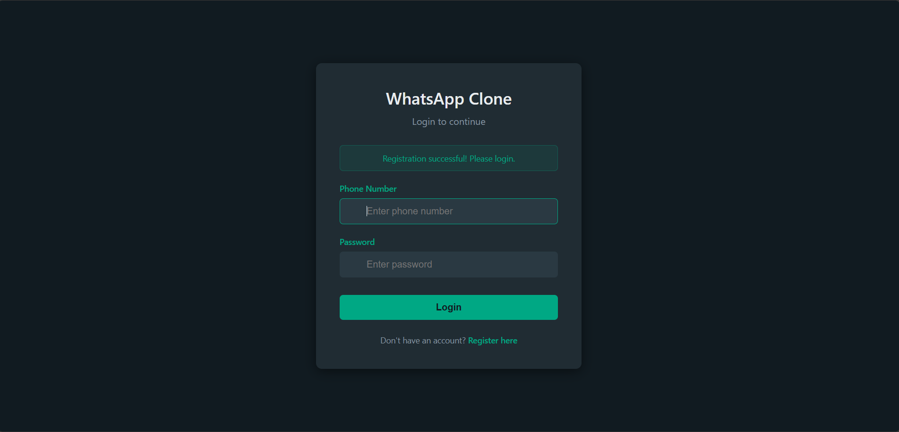
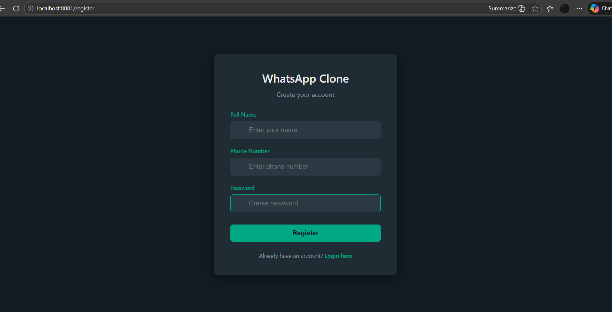
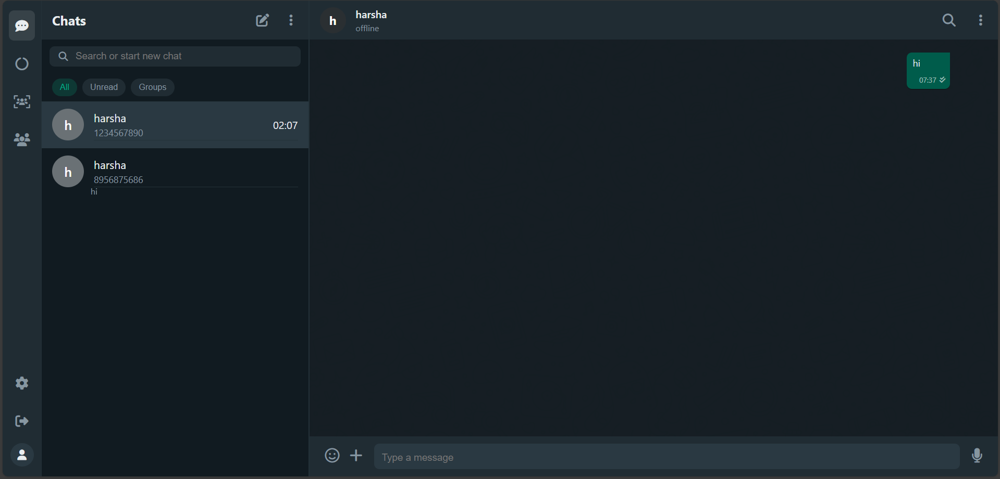

# WhatsApp Clone - Full Stack Messaging Application


A modern, high-performance, and feature-rich WhatsApp Clone built using **Spring Boot**, **MySQL**, and **WebSockets**. This application replicates the core functionalities of WhatsApp Web with a focus on real-time communication and a sleek dark-mode aesthetic.

## � Screenshots

| Login Page | Registration Page |
|------------|-------------------|
|  |  |

### 💬 Main Chat Interface


## �🚀 Features

### 💬 Real-Time Messaging
- **Instant Communication**: Powered by WebSockets for seamless, instant message delivery.
- **Typing Indicators**: Real-time feedback when a contact is typing.
- **Read Receipts**: Visual confirmation when messages are delivered and read.

### 📁 Media & Messaging Tools
- **Media Support**: Send and receive images and videos in chats.
- **Starred Messages**: Save important messages for quick access later.
- **Message Deletion**: Support for "Delete for Me" and "Delete for Everyone".
- **Search**: Powerful search functionality within chat histories.

### 👤 User Management
- **Secure Authentication**: Robust Sign-up and Login system.
- **Profile Customization**: Update your name, about section, and profile status.
- **Unread Counters**: Dynamic unread message counts for each contact.

### 🎨 Premium UI/UX
- **WhatsApp Web Design**: Accurate reproduction of the WhatsApp Web interface.
- **Dark Mode**: Optimized for visual comfort with professional-grade CSS styling.
- **Responsive Animations**: Smooth transitions and micro-interactions for a premium feel.

## 🛠 Tech Stack

- **Backend**: Java, Spring Boot, Spring Data JPA, Spring WebSocket
- **Frontend**: JSP (JavaServer Pages), Vanilla CSS, JavaScript (ES6+)
- **Database**: MySQL 8.0
- **Build Tool**: Maven
- **Server**: Embedded Tomcat

## ⚙️ Setup & Installation

### Prerequisites
- Java 11 or higher
- MySQL Server 8.0+
- Maven 3.6+

### 1. Database Configuration
1. Create a MySQL database named `whatsapp_db`.
2. Update the credentials in `src/main/resources/application.properties`:
   ```properties
   spring.datasource.username=your_username
   spring.datasource.password=your_password
   ```

### 2. Build the Project
Open your terminal in the project root and run:
```bash
mvn clean install
```

### 3. Run the Application
You can start the server using the provided batch file or via Maven:
```bash
./run.bat
# OR
mvn spring-boot:run --server.port=8081
```

Access the application at: `http://localhost:8081`

## 📂 Project Structure

- `src/main/java/com/whatsapp/controller`: API Endpoints and Web Controllers.
- `src/main/java/com/whatsapp/entity`: Database models (User, Message).
- `src/main/java/com/whatsapp/service`: Business logic layer.
- `src/main/webapp/WEB-INF/views`: JSP templates for the UI.
- `database/schema.sql`: Initial SQL scripts for table creation.

---
*Developed as a high-fidelity replica for learning and demonstration purposes.*
